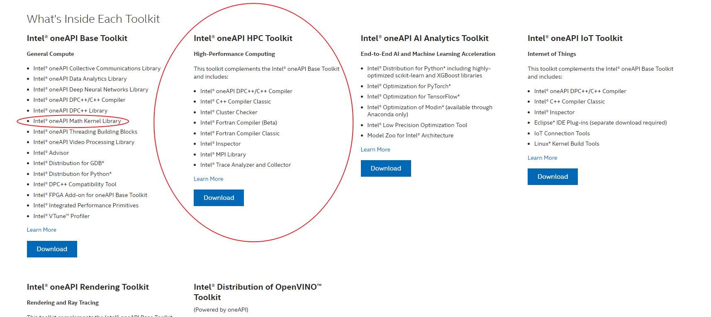
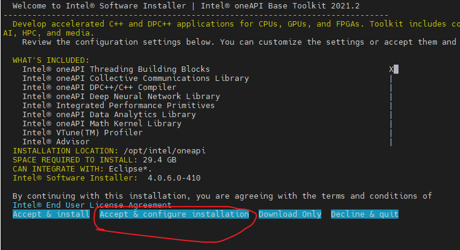
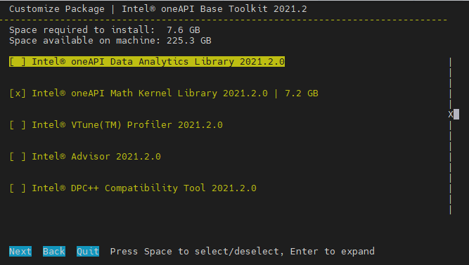

# 软件安装

## Matlab  
   大部分软件都是免费的，但有些软件是商业软件需要配置密钥。这里只介绍 Matlab 的激活。
   为了离线也能正常使用，如果是清华的同学，建议使用清华账户激活，仅对个人用户有效。

- 前提先连上校园网，运行 matlab, 出现以下情况时，直接点击 Next


- 按步骤，根据清华邮箱激活即可，如果没有注册，可以用邮箱注册。


另外，在安装 matlab 的时候，请选择网络版安装，不要使用清华邮箱激活安装，否则只能是安装的用户可以打开 matlab, 其他用户不能打开。安装网络版后，再将 licenses 中的 network.lic 文件删除即可，这样就可以让其他用户通过自己清华账户激活并离线使用。网络版安装流程(网络版必须联网才能使用，不方便)，见[清华 matlab 安装手册](http://its.tsinghua.edu.cn/ggrj.jsp?urltype=tree.TreeTempUrl&wbtreeid=1079)（仅校园内网访问）。

## FFTW

FFTW3 最新版下载网站[https://www.fftw.org/](https://www.fftw.org/)

以FFTW 3.3.10版本为例

###  解压

```shell
tar -zxvf fftw-3.3.10.tar.gz
```

```
cd fftw-3.3.10
```


### 安装
- 默认安装， 默认安装到/usr/local/bin

```shell
./configure
make -j64 ##多线程编译，取决有多少核
sudo make install
```

如果要自定义安装路径

```shell
./configure --prefix=/opt/fftw
make -j64
sudo make install
```

### 卸载

```shell
sudo make uninstall
```

其他./configure 选项见[https://www.fftw.org/fftw3_doc/Installation-on-Unix.html](https://www.fftw.org/fftw3_doc/Installation-on-Unix.html)

或者

```
./configure --help
```

### 配置
在编译时添加以下编译选项即可

```
-I/opt/fftw/include -L/opt/fftw/lib -lfftw3 -lm 
```
### 其他
如果使用oneAPI中的mkl内的fftw3，加载oneAPI环境后，只需要在编译的时候添加以下编译选项即可

```
-lmkl_intel_lp64 -lmkl_intel_thread -lmkl_core -liomp5 -lmkl_intel_thread
```

## oneAPI Toolkits

intel官网提供的说明,[**点击阅读原文可链接官网**](https://software.intel.com/content/www/cn/zh/develop/tools/oneapi/all-toolkits.html#gs.d3ir8x)



我们仅需要oneAPI Base Toolkit中的MKL库，以及oneAPI HPC Toolkit.
### 下载与安装
可以选择download, 跟随页面提示，选择下载版本。在这里我们的选择为：


在linux服务器上（前提已经连上校园网），可以通过官网提供的下载命令按照步骤安装即可
- 基础包（主要为了MKL）

```bash
wget https://registrationcenter-download.intel.com/akdlm/irc_nas/18673/l_BaseKit_p_2022.2.0.262_offline.sh

sudo sh ./l_BaseKit_p_2022.2.0.2
```

- 高性能计算包(MPI, Fortran)

```
wget https://registrationcenter-download.intel.com/akdlm/irc_nas/18679/l_HPCKit_p_2022.2.0.191_offline.sh

sudo sh ./l_HPCKit_p_2022.2.0.19
```
如果官网有最新版本，请下载最新版本

**注意**

基础包中，我们只需要MKL,其他的看自己的需求选择。在安装过程中选择Accept & configure install, 关闭其他暂时不需要的模块。(使用空格进行选择或者取消选择)。 让其默认安装在路径/opt/intel/oneapi即可





### 配置
- 进入个人的bashrc编辑：

```
vim ~/.bashrc
```
- 添加source

```
source /opt/intel/oneapi/setvars.sh --force
```
加载环境变量，如果mpi不起效果，请额外添加HPC的环境变量

```
source /opt/intel/oneapi/compiler/202x.x.x/env/vars.sh  ##202x.x.x为对应的版本好，具体请根据具体情况填写
```


最后source bashrc

```
source ~/.bashrc
```
输出下列信息，显示安装成功。然后就可以正常使用mpiifort, ifort 以及mkl.
